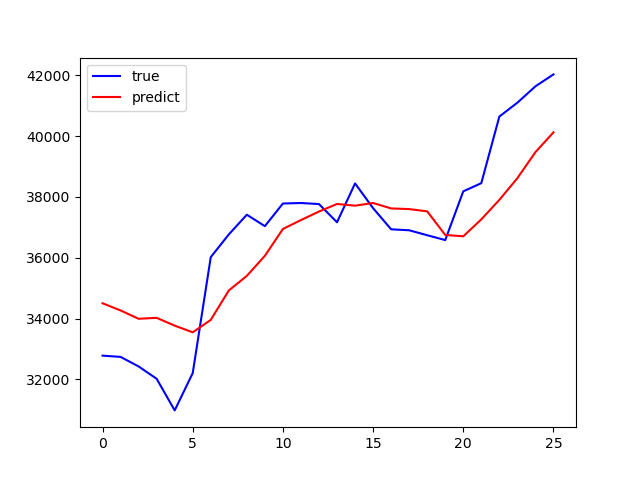

# An experiment with Bitcoin dataset

Noted: all steps are listed in `main.py`, uncomment to reproduce each step.

## Crawl dataset
`crawler.py`: call _Cryptocompare's api_ to get raw dataset.

## Explore dataset
- use variable `close` to investigate _Bitcoin price_ over the period.
- use `volumefrom` to track _Bitcoin volume_ over the period.
- for details, please see [python notebook](visualization.ipynb)

## Build a model to predict Bitcoin's price
- target variable to predict: `close`
- historical data used as features: `close`, `open`, `high`, `low`
- a look at model's performance:

- 